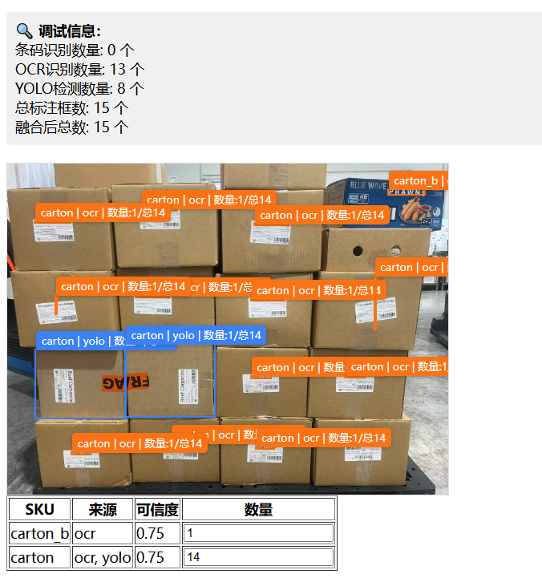

# Goods OCR Inventory

基于 **阿里云 OCR / 条码识别 + YOLO 目标检测** 的箱货盘点系统，用于自动统计堆叠纸箱的 SKU 数量，辅助仓库 / 门店做库存盘点。

GitHub： https://github.com/blingkwan/goods-ocr-inventory

---

## 功能特性

### 多源识别融合

- **条码识别（Barcode）**
  - 阿里云条码识别接口
  - 精确匹配 SKU（最高优先级）

- **OCR 文本识别（OCR）**
  - 阿里云通用文字识别
  - 基于 `keywords` 进行模糊匹配

- **YOLO 目标检测（YOLO）**
  - 本地 YOLO 模型检测纸箱位置
  - 提供箱体数量基础

---

### 智能去重与数量统计

- 同一 SKU 下，使用 **IoU + IoM（交集 / 最小面积）** 判断是否为同一箱
- 解决 OCR 小框被 YOLO 大框包含的问题
- 识别结果融合优先级：

```
barcode > ocr > yolo
```

- 最终输出：
  - count（数量）
  - confidence（综合置信度）
  - sources（识别来源）

---

### 可视化标注

- 绿色：Barcode
- 橙色：OCR
- 蓝色：YOLO

标注格式：

```
SKU 名称 | 来源 | 数量: 1 / 总N
```

支持人工修正数量。

---

### 检测记录存档

每次识别结果会写入 `detect_records` 表：

- 原始图片路径
- Barcode / OCR / YOLO 原始结果
- 融合后的最终结果
- 最大置信度
- 是否需要人工确认

---

## 技术栈

- 后端：Laravel (PHP)
- 前端：Blade + 原生 JS / CSS
- 识别服务：
  - 阿里云 OCR / 条码
  - 本地 YOLO 推理
- 数据库：MySQL

---

## 项目结构

```
app/
├── Http/Controllers/DetectController.php
├── Services/
│   ├── AliVisionService.php
│   ├── YoloService.php
│   └── FusionService.php
resources/views/detect/
├── form.blade.php
└── result.blade.php
sql/
└── inventory.sql
```

---

## 快速开始

### 1. 克隆项目

```
git clone https://github.com/blingkwan/goods-ocr-inventory.git
cd goods-ocr-inventory
```

### 2. 安装依赖

```
composer install
npm install
npm run dev
```

### 3. 环境配置

```
cp .env.example .env
php artisan key:generate
```

配置数据库、阿里云密钥、YOLO 服务。

### 4. 数据库

```
php artisan migrate
mysql -u root -p your_db < sql/init_skus.sql
```

### 5. 启动

```
php artisan serve
```

访问： http://127.0.0.1:8000

---

## 示例图片




---

## TODO

- 管理后台
- 导出 Excel / CSV
- 权限系统
- Docker 部署
